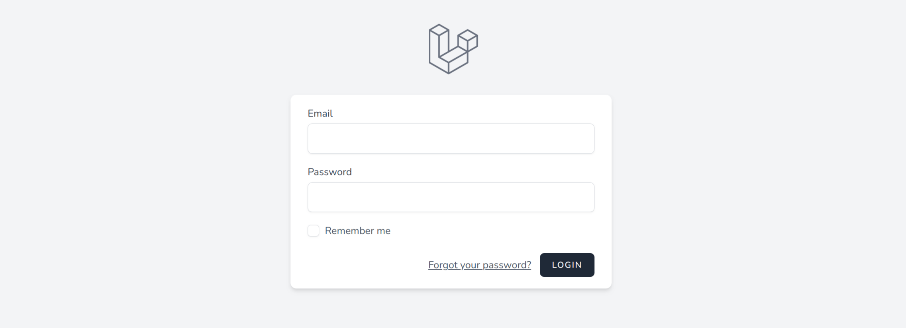

# Laravel Breeze

> Laravel Breeze es un kit de inicio minimalista, para uns sencillísima implementacion de las características de autenticación de Laravel.   
> Incluye un sistema de login, un sistema de registro, uno de reseteo de contraseña, verificación de email y confirmación de contraseña.
> Laravel Breeze implementa una capa predeterminada de vistascompuesta por plantillas Blade utilizando los estilos de Tailwind CSS.   
> Breeze provee un maravilloso punto de inicio para comenzar un nuevo proyecto Laravel.

- [ ] Crear proyecto nuevo

        composer create-project laravel/laravel login

- [ ] Crear nueva base de datos

> Usando mySQL Workbench, phpMyAdmin o similar, crear una nueva base de datos  

