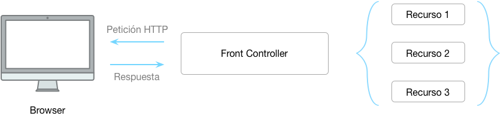

# Peticiones

> El primer concepto que debemos tener en cuenta es el de **peticiones**: le vamos hacer una petición a nuestra aplicación y esta nos va a responder con un recurso. 

> El recurso puede ser una vista generalmente, aunque podemos obtener otro tipo de recursos. 

> El segundo concepto es el del Enrutador, técnicamente este es el proveedor del servicio de peticiones. 
> Cuando hacemos una petición esta es recibida por el enrutador que se encargará de; según la peticion, ejecutar una acción y luego responder con un recurso.

> La sintáxis es: 

    Route::metodo( 'petición', acción );

